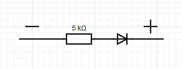
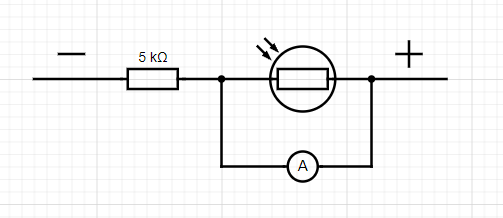

# LedPhotoDistributedSerial

Программа управляет освещением, используя данные от датчика освещенности. 
Датчик и светодиод подключены к разным микроконтроллерам, которые работают независимо друг от друга. 
Данные от датчика получаются в arduino, а затем отправляются в скрипт pythoon. 
В зависимости от показаний датчика освещенности решается, включать или выключать свет. 
Программа отправляет запрос в arduino, где происходит включение или выключение светодиода.

## Возможности
- **Получение данных освещенности** Получает беспрерывно данные с датчика освещенности в реальном времени.
- **Включение светодиода** Если значение освещенности больше или равно 700.
- **Выключение светодиода** Если значение освещенности меньше 700.

## Команды (передаются автоматически из скрипта python)
- **'p'**: Получение значения освещенности.
- **'u'**: Включение сигнала.
- **'d'**: Выключение сигнала.

## Описание программы **arduino**
Данная программа реализует управление светодиодом на основе полученных данных от датчика освещенности.  

### Функционал:

* Прием команд: Программа ожидает команд, отправленных по COM-порту с компьютера. 
* Управление светодиодом:
    * Команда `'u'` включает светодиод.
    * Команда `'d'` выключает светодиод.
* Считывание данных от датчика:
    * Команда `'p'` заставляет программу считать данные от датчика освещенности (подключенного к аналоговому пину `A0`) и отправить их обратно на компьютер.
    * Данные считываются через функцию `analogRead`, затем сжимаются (деление на 4) для экономии трафика и отправляются в виде байта. 

### Описание кода:

* **#define:**

  Задаются константы для пинов светодиода (`PIN_LED_1`), датчика освещенности (`PIN_PHOTO_SENSOR_1`) и команд (`SET_ON`, `SET_OFF`, `SET_PHOTO`).

* **pause:**

  Функция, которая вводит паузу в выполнение программы на заданное время (в миллисекундах). 

* **getting_command:**

  Функция, которая считывает команды с USB-порта и выполняет соответствующие действия. 

* **setup:**

  Функция, которая выполняется только один раз при запуске программы. В ней инициализируется последовательный порт и устанавливается пин светодиода в режим вывода.

* **loop:**

  Функция, которая выполняется в цикле бесконечно. В ней вызывается функция `getting_command` для обработки команд с компьютера.

### Работа программы:

1. Программа устанавливает связь через COM-порт.
2. Ожидает команды с компьютера.
3. При получении команды `'u'`, `'d'` или `'p'`, программа выполняет соответствующее действие: включение/выключение светодиода или считывание данных от датчика.
4. Считанные от датчика данные отправляются обратно на компьютер ЛИБО происходит включение/выключение светодиода. 

## Описание программы **python**
Данная программа реализует управление светодиодом, подключенным к Arduino, используя данные от датчика освещенности (также подключенного к другому Arduino).

### Функционал:

* Управление двумя Arduino: Программа работает с двумя Arduino, подключенными к разным COM-портам компьютера.
* Считывание данных от датчика:
    * Программа отправляет команду 'p' на Arduino с датчиком освещенности, чтобы получить данные.
    * Она ожидает получения данных от датчика в виде байта.
    * Полученный байт преобразуется в десятичное число и умножается на 4 (для обратного преобразования сжатых данных, полученных от Arduino).
* Управление светодиодом:
    * Программа сравнивает считанное значение освещенности с порогом (700 единиц).
    * Если значение больше или равно порогу, программа отправляет команду 'u' на Arduino со светодиодом, чтобы включить его.
    * В противном случае, программа отправляет команду 'd' на Arduino со светодиодом, чтобы выключить его.

### Описание кода:

* **import serial:**

  Импортируется библиотека `serial` для взаимодействия с COM-портами.

* **photo_val_resp:**

  Переменная для хранения значения освещенности.

* **responses:**

  Словарь, содержащий информацию о длинах ответов для каждой команды (0 - нет ответа, 1 - 1 байт для 'p', 0 - для 'u' и 'd').

* **port_led, port_photo:**

  Переменные, хранящие имена COM-портов для Arduino со светодиодом и датчиком освещенности.

* **connection_led, connection_photo:**

  Объекты класса `serial.Serial` для связи с Arduino.

* **send_command:**

  Функция, отправляющая команду на Arduino и считывающая ответ. 

* **Основной цикл (бесконечный):**
    * Отправляется команда 'p' на Arduino с датчиком освещенности.
    * Считывается ответ, пока он не будет получен.
    * Сравнивается полученное значение освещенности с порогом.
    * Отправляется команда 'u' или 'd' на Arduino со светодиодом, чтобы включить или выключить его.

### Работа программы:

1. Программа устанавливает соединение с Arduino через COM-порты.
2. В цикле она отправляет команду 'p' на Arduino с датчиком освещенности, получает данные и преобразует их в десятичное значение.
3. В зависимости от значения освещенности, программа отправляет команду 'u' или 'd' на Arduino со светодиодом, чтобы включить или выключить его.
4. Цикл повторяется бесконечно, обеспечивая постоянный мониторинг уровня освещенности и управление светодиодом.

## Использование.

1. Подключение:

    * Подключите датчик освещенности к аналоговому пину `A0` на Arduino, подключенному к порту `COM8` (по примеру Python кода). 
    * Подключите светодиод к пину `13` на Arduino, подключенному к порту `COM3` (по примеру Arduino кода).
    * Загрузите скетч Arduino в ваш Arduino.

2. Запуск Python-кода:

    * Запустите Python-код.
    * Убедитесь, что COM-порты указаны правильно.

## Аппаратная конфигурация
- **Светодиод**: Пин 13.
- **Датчик освещенности**: Пин A0.

## Демонстрация

## Схемы
### Схема подключения светодиодов

*  Каждый светодиод подключён к своему "+", на плате это пины 13 и 10
*  Каждый светодиод подключён к "-" через резистор, котороый подключён в колодку "-" на плате, которая в свою очередь соединена с пином GND
*  Каждый резистор номиналом 5 кОм

### Схема подключения фоторезисторов

*  Каждый светодиод подключён к своему аналоговому пину: A0 и A1
*  Каждый фоторезистор подключён к "-" через резистор, котороый подключён в колодку "-" на плате, которая в свою очередь соединена с пином GND
*  Каждый резистор номиналом 5 кОм
