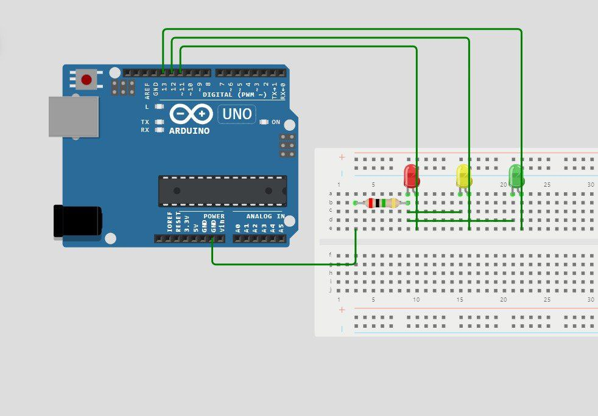

# Система управления светофором

Этот проект управляет простой системой светофора с использованием светодиодов для зелёного, жёлтого и красного света. Программа работает в двух режимах: **автоматический режим** и **ручной режим**, которые переключаются с помощью последовательной связи. В **ручном режиме** пользователь может переключаться между красным и зелёным сигналами. Переход между сигналами выполняется через жёлтый свет при необходимости. Если ручной режим активен более 60 секунд без ввода, система автоматически возвращается в автоматический режим.

##Схема

## Возможности
- **Автоматический режим**: Симуляция поведения светофора.
- **Ручной режим**: Позволяет пользователю переключаться между красным и зелёным сигналами через последовательные команды.
- **Ограничение времени ручного режима**: Через 60 секунд неактивности система автоматически возвращается в автоматический режим.
- **Переход через жёлтый свет**: В ручном режиме при переключении между красным и зелёным светом включается жёлтый сигнал на 3 секунды.

## Команды
- **'a'**: Переключение в автоматический режим.
- **'m'**: Переключение в ручной режим.
- **'g'**: В ручном режиме включение зелёного сигнала.
- **'r'**: В ручном режиме включение красного сигнала.

## Описание программы

### `loop()`
Главный цикл программы вызывает две основные функции:
1. `update_mode()`: Эта функция проверяет команды пользователя и переключает режимы. Она также отслеживает время в ручном режиме.
2. В зависимости от режима вызывается `process_auto_mode()` или `process_manual_mode()`, которые обрабатывают либо автоматическую последовательность светофора, либо команды ручного режима.

### Состояния
- **`isAutoMode`**: Указывает, находится ли система в автоматическом или ручном режиме.
- **`manualCommand`**: Хранит последнюю команду, выданную пользователем в ручном режиме ('g' или 'r').
- **`autoState`**: Контролирует последовательность автоматического переключения светофора.

### `update_mode()`
- Ожидает ввод с последовательного порта.
- Если получена команда `'a'`, система переключается в автоматический режим.
- Если получена команда `'m'`, система переключается в ручной режим.
- В ручном режиме отслеживает время с момента активации. Если прошло 60 секунд, система автоматически возвращается в автоматический режим.

### `process_auto_mode()`
Отвечает за автоматическую последовательность переключения светофора:
1. **Зелёный свет включён на 10 секунд**.
2. **Мигающий зелёный свет** (4 цикла по 500 мс).
3. **Жёлтый свет включён на 1 секунду**.
4. **Красный свет включён на 7 секунд**.
5. **Жёлтый свет включён на 1 секунду**, затем цикл повторяется.

### `process_manual_mode()`
- Если получена команда на смену света, проверяется текущее состояние.
- Если нужно переключиться между красным и зелёным, жёлтый свет включается на 3 секунды.
- Если ручной режим активен 60 секунд без команд, система автоматически возвращается в автоматический режим.

### `leds_off()`
Выключает все светодиоды перед включением нужного сигнала, чтобы только один светодиод был активен в любой момент времени.

## Аппаратная конфигурация
- **Зелёный светодиод**: Пин 13.
- **Жёлтый светодиод**: Пин 12.
- **Красный светодиод**: Пин 11.
## Основные функции

### `pause(unsigned long duration)`
Блокирующая функция, которая останавливает выполнение программы на указанное время, используя `millis()` для точного отслеживания времени.

## Использование

1. Загрузите программу на плату Arduino.
2. Откройте последовательный монитор и установите скорость передачи в `9600`.
3. Используйте следующие команды для управления светофором:
   - Введите `'a'`, чтобы переключиться в автоматический режим.
   - Введите `'m'`, чтобы переключиться в ручной режим.
   - В ручном режиме введите `'g'`, чтобы включить зелёный свет, или `'r'`, чтобы включить красный свет.

## Возможные улучшения
- Добавить обработку ошибок для некорректных команд.
- Реализовать неблокирующую задержку с использованием `millis()` вместо блокирующей функции `pause()`.
- Расширить функциональность для управления дополнительными светодиодами или добавить новые режимы.

## Демонстрация
[Автоматическое](https://drive.google.com/file/d/1YnW-UpSIGs-cqXMzE_rZFz48GjtCdia8/view?usp=sharing)   
[Ручной](https://drive.google.com/file/d/1yhva5JxDYfaJMH4ATXGinV9cigerLfT_/view?usp=sharing)   

## diagram

